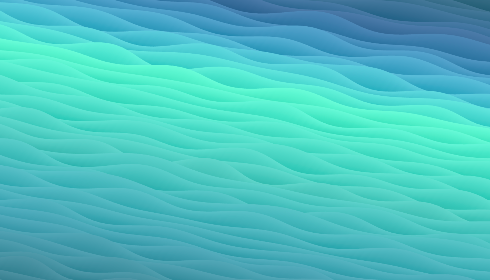

## 🌐 My Personal Website



[**aidenkt.com**](https://aidenkt.com) — a single-screen landing page with an animated WebGL gradient, a frosted-glass contact card, and not much else. It loads fast, works offline of any framework, and gets out of the way.

---

### What's in it

**A living background.** The gradient isn't an image — it's 60 polylines rendered in Three.js, each one a strip of geometry displaced in a vertex shader by layered cosine waves with per-line random seeds. Colors come from a `chroma-js` LCH scale, so the whole ramp stays perceptually smooth as it shifts. Two `mix-blend-mode: color` overlays cross-fade on a 20-second cycle, cycling the page from sunset orange through teal to magenta, and the browser's `theme-color` follows along so the address bar matches.

**A card you can push around.** The contact card is a real backdrop-filtered glass panel — blur, saturation, layered inset highlights, a specular sweep — sitting in a `perspective: 900px` scene. Drag it and it tilts on rotateX/rotateY, clamped to 9°, rAF-throttled, with a click-suppression window so a drag never accidentally fires a link. Pointer capture keeps taps on the icons working anyway. All of it is skipped under `prefers-reduced-motion`.

**iOS Safari edge-to-edge.** iOS 26 Safari only composites real page pixels behind its translucent top and bottom chrome when the document sits at a non-zero scroll offset — at `scrollY: 0` it paints a flat sampled color instead. So the page carries a 140px "runway" of extra canvas above and below and rests scrolled down by exactly that much. `overflow-y: hidden` on the root means the distance exists for Safari's compositor but the user can never scroll it, leaving a single screen with native overscroll intact.

**Written for machines too.** [`llms.txt`](resources/static/llms.txt) and [`about.md`](resources/static/about.md) give agents and crawlers a clean, first-party source, and the page ships JSON-LD `Person` structured data.

**A privacy page that says what actually happens.** [`/privacy`](https://aidenkt.com/privacy) documents the analytics in plain language, with its own accent animation on the same 20-second cycle.

---

### Stack

| | |
|---|---|
| Rendering | [Three.js](https://threejs.org) r110 + custom GLSL, [chroma-js](https://gka.github.io/chroma.js/) |
| Page | Hand-written HTML/CSS/JS — no framework, no build step |
| Icons | Inline SVG |
| Server | Express (local dev + analytics middleware) |
| Analytics | [PostHog](https://posthog.com), reverse-proxied through `wsp.aidenkt.com` |
| Hosting | Vercel static |

---

### Running it locally

```bash
npm install
npm run dev     # node --watch index.js  →  http://localhost:3000
```

`npm start` runs it without the watcher. PostHog needs two env vars in `.env`; without them the page still renders fine, the server just won't report anything:

```
POSTHOG_API_KEY=phc_...
POSTHOG_HOST=https://...
```

There's an easter egg: append `?start` to the URL for a deep-teal palette with the card hidden.

---

### Layout

```
index.js                       Express server + PostHog page/resume events
vercel.json                    static build + /privacy rewrite
resources/static/
├── index.html                 the page — meta, JSON-LD, PostHog snippet
├── style.css                  glass card, overlays, runway, responsive tiers
├── script.js                  WebGL background, Polyline, tilt, palette cycle
├── about.md                   human- and agent-readable bio
├── llms.txt                   machine-readable site index
├── resume.pdf
├── wallpaper.png              og:image
└── privacy/                   privacy policy page
```

Deploys are static — `vercel.json` serves `resources/static/**` directly and rewrites `/privacy`. The Express server exists for local development and to record `page viewed` / `resume downloaded` server-side.

---

<sub>© Aiden Tabrizi · <a href="https://github.com/aidenkt">GitHub</a> · <a href="https://www.linkedin.com/in/aidenkt/">LinkedIn</a></sub>
